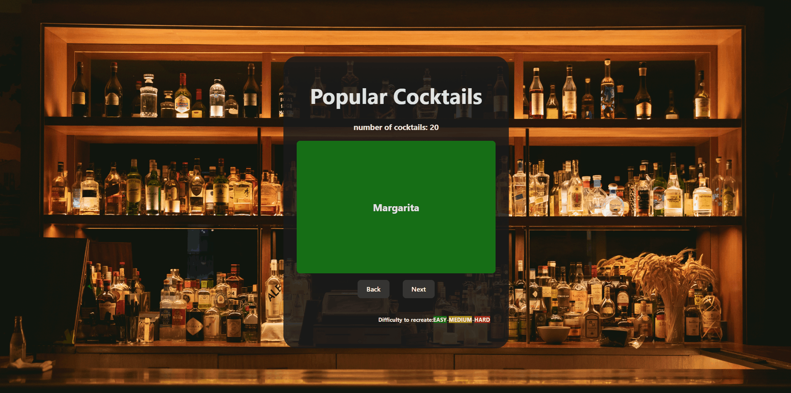

# *Popular Cocktails*
Submitted by: **Franklin Neves Filho**

**This web app contains about 20 flashcards about the most popular drinks throughout american bars. You can test your skills and see if you can remember them like a real bartender!**

Time spent: **5** hours spent in total

## Required Features

The following **required** functionality is completed:

- [X] **The title of the card set and some information about it, such as a short description and the total number of cards are displayed**
- [X] **A single card at a time is displayed, only showing one of the components of the information pair**
- [X] **A list of card pairs is created**
- [X] **Clicking on the card shows the corresponding component of the information pair**
- [X] **Clicking the next button displays a random new card**

The following **optional** features are implemented:

- [ ] Cards contains images in addition to or in place of text
- [X] Each card has a certain difficulty level corresponding to the ease of recreating the cocktail.

The following **additional** features are implemented:

* [X] A back button to go back to the previously seen card
* [X] A flip animation when the card is clicked
* [X] Dynamically adding list of ingredients to the card

## Video Walkthrough

Here's a walkthrough of implemented required features:

GIF created with ...  
[ScreenToGif](https://www.screentogif.com/) for Windows

## Notes

I had somewhat of a difficulty figuring out the back button as I was unsure how to properly use the useState and props feature.

Also, to implement the flip animation in css, was new to me and very interesting to learn.

## License

    Copyright [2023] [Franklin Neves Filho]

    Licensed under the Apache License, Version 2.0 (the "License");
    you may not use this file except in compliance with the License.
    You may obtain a copy of the License at

        http://www.apache.org/licenses/LICENSE-2.0

    Unless required by applicable law or agreed to in writing, software
    distributed under the License is distributed on an "AS IS" BASIS,
    WITHOUT WARRANTIES OR CONDITIONS OF ANY KIND, either express or implied.
    See the License for the specific language governing permissions and
    limitations under the License.
